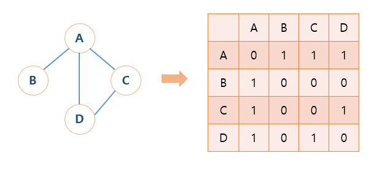

## Priority Queue 우선순위 큐

Queue는 순차적으로 들어간 후, 앞에서부터 빠져나가는 것을 말함   

**우선순위 큐**는 큐들이 하나씩 순차적으로 쌓이는 것 까지는 동일    
하지만, 급하게 처리해야 할 일이 있다면??    
*순차적으로 쌓인 큐들을 무시하고, 앞쪽에 넣어서 먼저 처리하는 일이다 !*   

실생활에 비유하자면,   
VVIP는 백화점 우선 주차할 수 있음 ...    

우선순위 큐는 **이진 힙**으로 구현 (이진힙을 조금 변형한)   

**시간 복잡도**는 큐는 O(1)가 상수로 빠르게 동작했지만, **우선순위 큐**는 기능 때문에 **이진 힙을 사용해 O(logn)이 된다.**   

---

## Deque 덱

자료구조 중, 덱이라는 자료구조를 굳이 추가로 설명하자면...??    
**스택(Stack) + 큐(Queue)를 합친 것을 덱(Deque)**이라고 한다    

- push 뒤에서 추가
- pop 뒤에서 삭제
- shift 앞에서 삭제
- unshift 앞에서 추가      

( javascript 배열과 가장 비슷 )

---

## Graph 그래프

트리를 좀 더 일반적인 모습으로 가지고 있는 자료구조   
"leaf"는 없고 **서로 간의 연결구조를 가지고 있는 자료구조** (서로서로 이어져있다)    
트리는 그래프의 일종인데, 아주 특수한 그래프라고 보면 된다   

 
-> 그래프에선 Node를 Vertex, Edge를 Arc라고 한다    

1. **In-degree** : 기준 vertex로 오는 arc의 갯수
2. **Out-degree** : 기준 vertex에서 다른 vertex로 빠져 나가는 arc의 갯수

arc가 빠져나가는지 들어오는지 구별을 할 수 없는 경우 *무방향그래프*
- **무방향** : 화살표가 없기 때문에 In-degree === Out-degree 갯수는 같다   
- **방향** : 화살표가 양쪽에 있다면 *양방향*, 한쪽으로만 있다면 *단방향*   

### 그래프는 프로그래밍으로 표현할 때, 다양한 방향이 있다 !   
vertex들이 있고, vertex들의 연결관계인 arc가 있다면?   
=> 이것을 *이차원 배열*로 만들 수 있다.  

 .   

1. **2차원 배열 사용** (Adjacency Metrix)
- vertex를 담아두는 1차원 배열, arc들을 담아두는 2차원 배열로 그래프 구성
- 간단하지만 공간을 많이 차지함
- 시간복잡도는 O(1)

2. **배열 및 연결리스트 사용**
- 해당 vertex가 누구와 연결되어 있는지 알아내기 복잡
- 공간을 적게 차지함 (공간복잡도는 arc의 갯수만큼 차지)
- 시간복잡도는 O(n)

*두가지 중 추천하는 방법은?? **이차원배열***
: 공간복잡도보다는 시간복잡도를 줄이는 것이 효율적!!

## Hash Table 해시테이블

해시테이블은 Javascript로 봤을 때 **객체**라고 생각하면 된다.   

객체를 쓰면 좋은 점은 *key와 value를 다양하게 넣을 수 있다*는 것 !!   
해시테이블의 시간복잡도는 O(1)이다.   

Javascript에서는 객체를 사용하면 되지만, 일부러 Node를 만들어 next()로 계속 이어줬던 것과 같은 맥락   
(배열을 만들어버리면, 자료구조를 배우는 의미가 없지 않을까....?)   

해시테이블도 자료구조에서 한 가지 제약이 있음...   
=> **value 저장 시 용량 제약이 있다**   

*비둘기 집의 원리를 생각했을 때, n+1개의 물건을 n개의 상자에 넣을 경우 적어도 어느 한 상자는 두 개 이상의 물건이 들어있음*   
*즉, 용량의 제한에 맞추기 위해서는 결국에는 key, value들이 한 칸에 여러 개 들어갈 수 밖에 없다*   

여기서 신경써야하는 점 !   
**각각의 값이 어느 칸에 저장되어야 하는지 중요**   
-> 한 칸에 모두 저장되어버리면 연결리스트가 되어버린다...(O(n)으로 비효율적)   
-> **칸에 제한이 있을 경우, 데이터들을 어떻게 칸에 최대한 겹치지 않게 골고루 분배하느냐가 가장 중요한 핵심**   

예시
용량제한은 30까지라 가정하고, 넣어야할 데이터는 30개 이상이라고 했을 시,
연결리스트 또는 배열로 한 칸에 여러개의 값을 저장하는 것 (=**해시테이블**)

### 해시함수
key를 hash로 바꿔줌 (hash는 칸의 갯수)    
key를 hash로 바꾸는 알고리즘을 구현 -> 이것을 해시함수
(이 해시함수를 골고루 분배 해줘야함)    

만약, 해시함수가 무조건 1을 return한다고 했을 때, key들을 모두 1번에 저장하게 되어 연결리스트가 되어버린다....(비효율적)   

그럼 return을 최대한 골고루 분배해주는 해시함수가 필요   

### 해시충돌 (collision)
만약 key들이 모두 숫자일 경우, key를 30으로 나누면 나머지 데이터들이 남게 됌   
그 나머지를 보고 칸의 번호로 사용!   

31(key)와 "hi"(value)를 넣어준다고 가정했을 때, 30으로 나눴을 때 나머지가 1이 되기 때문에 1번 데이터에 넣는다.   
또 다른 61(key) "bye"(value)를 넣는 경우에도 나머지가 1이 되기에 1번에 들어간다.   

해시함수의 결과 값이 같은 경우의 예시이다.    

*좋은 해시함수는 해시충돌이 최대한 적게 일어나는 함수를 좋은 함수라고 말할 수 있다*   

**조회의 경우**

해시화를 통해 해시칸에 맞는 데이터들을 연결리스트나 배열로 저장했을 때, 그럼 검색할 때는??   

search(61)과 같은 방법으로 key를 이용해 검색을 진행 (검색할 때도 key를 hash로 바꿔준다.)   
그럼 obj[hash]으로 배열이나 연결리스트에서 자신이 찾는 key가 있는지 검색을 하게 됌   

만약 61을 찾는다면?   
[{31 : "hi}, {61 : "bye"}] 배열에 이런 방식으로 들어가 있으면 검색하여 찾음   
해당하지 않는 key를 검색하면 null 반환