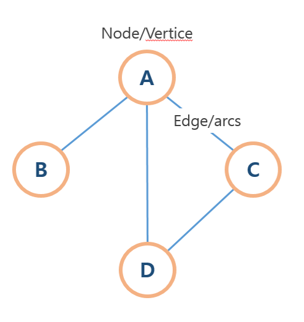
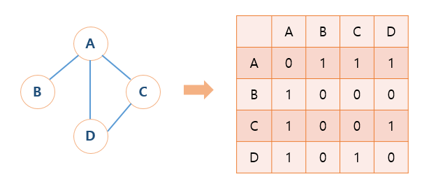

## Priority Queue 우선순위 큐

Queue는 순차적으로 들어간 후, 앞에서부터 빠져나가는 것을 말함   

**우선순위 큐**는 큐들이 하나씩 순차적으로 쌓이는 것 까지는 동일    
하지만, 급하게 처리해야 할 일이 있다면??    
*순차적으로 쌓인 큐들을 무시하고, 앞쪽에 넣어서 먼저 처리하는 일이다 !*   

실생활에 비유하자면,   
VVIP는 백화점 우선 주차할 수 있음 ...    

우선순위 큐는 **이진 힙**으로 구현 (이진힙을 조금 변형한)   

**시간 복잡도**는 큐는 O(1)가 상수로 빠르게 동작했지만, **우선순위 큐**는 기능 때문에 **이진 힙을 사용해 O(logn)이 된다.**   

---

## Deque 덱

자료구조 중, 덱이라는 자료구조를 굳이 추가로 설명하자면...??    
**스택(Stack) + 큐(Queue)를 합친 것을 덱(Deque)**이라고 한다    

- push 뒤에서 추가
- pop 뒤에서 삭제
- shift 앞에서 삭제
- unshift 앞에서 추가      

( javascript 배열과 가장 비슷 )

---

## Graph 그래프

트리를 좀 더 일반적인 모습으로 가지고 있는 자료구조   
"leaf"는 없고 **서로 간의 연결구조를 가지고 있는 자료구조** (서로서로 이어져있다)    
트리는 그래프의 일종인데, 아주 특수한 그래프라고 보면 된다   

 
-> 그래프에선 Node를 Vertex, Edge를 Arc라고 한다    

1. **In-degree** : 기준 vertex로 오는 arc의 갯수
2. **Out-degree** : 기준 vertex에서 다른 vertex로 빠져 나가는 arc의 갯수

arc가 빠져나가는지 들어오는지 구별을 할 수 없는 경우 *무방향그래프*
- **무방향** : 화살표가 없기 때문에 In-degree === Out-degree 갯수는 같다   
- **방향** : 화살표가 양쪽에 있다면 *양방향*, 한쪽으로만 있다면 *단방향*   

### 그래프는 프로그래밍으로 표현할 때, 다양한 방향이 있다 !   
vertex들이 있고, vertex들의 연결관계인 arc가 있다면?   
=> 이것을 *이차원 배열*로 만들 수 있다.  

 .   

1. **2차원 배열 사용** (Adjacency Metrix)
- vertex를 담아두는 1차원 배열, arc들을 담아두는 2차원 배열로 그래프 구성
- 간단하지만 공간을 많이 차지함
- 시간복잡도는 O(1)

2. **배열 및 연결리스트 사용**
- 해당 vertex가 누구와 연결되어 있는지 알아내기 복잡
- 공간을 적게 차지함 (공간복잡도는 arc의 갯수만큼 차지)
- 시간복잡도는 O(n)

*두가지 중 추천하는 방법은?? **이차원배열***
: 공간복잡도보다는 시간복잡도를 줄이는 것이 효율적!!

