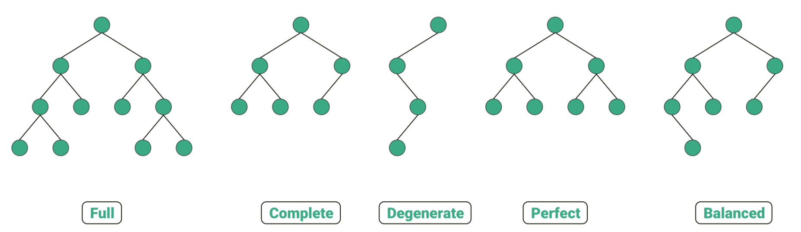

## Tree 트리

프로그래밍에서 Tree 구조의 시작점을 **Root**라고 한다.   
( root가 없는 구조의 경우 가상의 root를 만들 수 있음 )    
가지치기처럼 뻗어나가는 가지들을 **Node**라고 한다.    
뻗어나간 가지의 마지막 잎파리 부분을 **Loof**라고 한다.   

*HTML의 구조를 비유해보면 딱 트리구조 !!*

-> 사실상 트리가 가지들의 개수 등... 제한이 없기 때문에 너무 많은 트리들이 만들어짐   
그렇게 되면 알고리즘으로 트리를 활용하기에는 힘들어진다.    
그래서 **트리의 모양에 제한**을 둔다!   

### binary tree (이진 트리)
**가지가 최대 2개**   
없을 수도 있고, 하나만 있을 수도 있고, 최대 2개가 있을 수 있다   

---

### 이진트리의 종류

1. **Full** Binary tree *정이진트리*
- 자식(가지)이 0 or 2 

2. **Perfect** Binary tree *포화이진트리*
- 자식 노드가 0일 때
- leaf가 아닌 노드가 자식이 2개
- leaf들은 모두 같은 level에 있어야함
- 같은 층에 leaf들이 가득 차있어야함 (**삼각형 트리 모양**)

3. **Complete** Binary tree *완전이진트리*
- Full과 Perfect의 중간
- **왼쪽**부터 하나씩 데이터가 가득 채워지는 구성
- 그 과정 중에서 나오는 모든 트리들이 Complete트리
- 사용될 때는 데이터를 순서대로 하나씩 넣을 때, 정해진 모양(왼쪽부터)으로 데이터를 넣을 수 있음
- 즉, 마지막 level까지 꽉 차있지 않아도 되지만, 노드가 **왼쪽에서 오른쪽으로 채워져 있어야 함**

4. **Degenerate** (Skewed) Binary tree *편향이진트리*
- 자식의 개수가 모두 1개인 트리
- 가장 비효율적인 이진트리 중 하나
- 연결리스트 수준의 트리

5. **Balanced** Binary tree *균형이진트리*
- 모든 노드들이 **Diff가 0 or 1**
- 좌우 어느 쪽이 치우쳐져 있는지 판단할 때 Diff를 사용

---   

// 용어 정리
**Level**   
: 가지의 층   
( Root가 Level1, 그 다음 2개로 나눠진 가지들이 묶인 층이 Level2,,)   
**Height**   
: Root로부터 가지치기가 된 가지의 길이   
**Diff**   
: 자신을 기준으로 왼쪽 최대 height와 오른쪽 최대 height의 차이   
( Root의 Diff는 1 )   